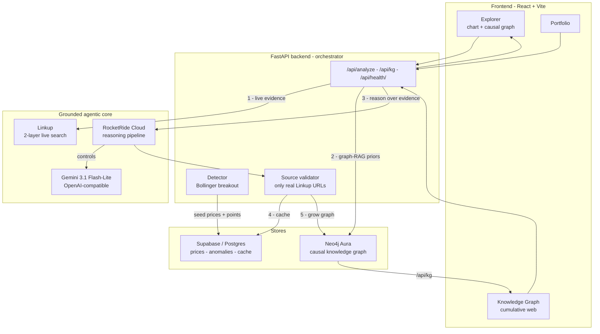
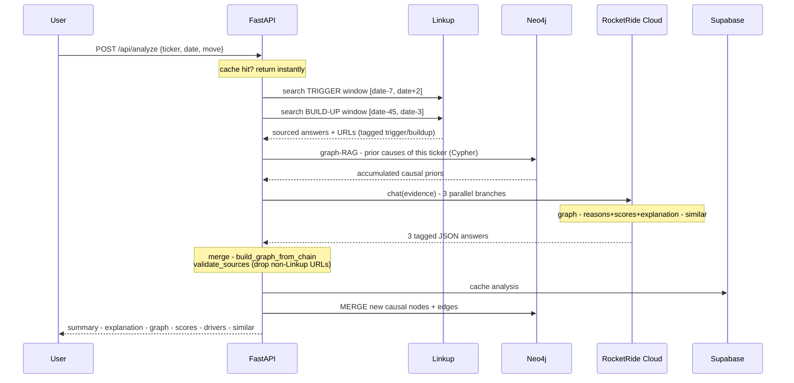
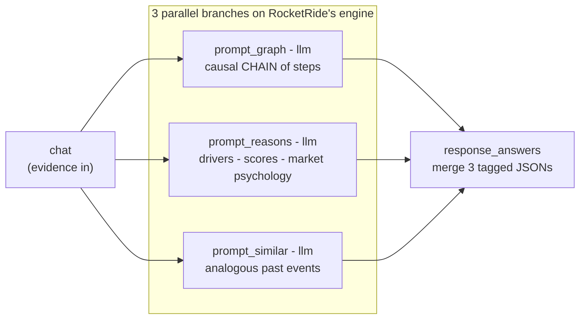
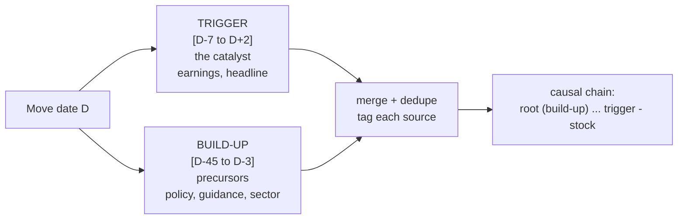
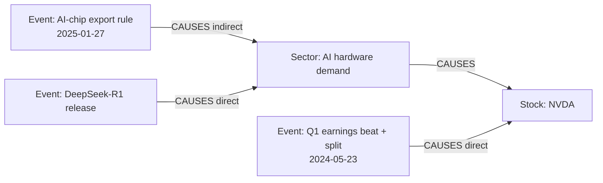
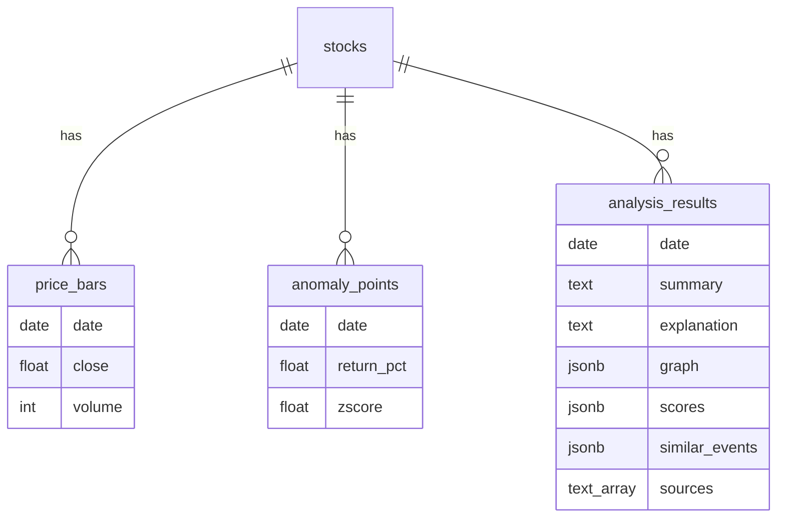
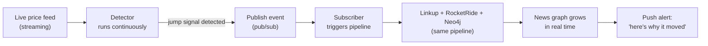

# WhyStreet - The Why Behind Wall Street

> A grounded, agentic explainer for stock price moves. WhyStreet detects sharp
> volatility points on a chart, then explains **why** each one happened as a
> **live-sourced causal chain** - every claim carries a real news URL, and the
> causality accumulates into a growing **Neo4j knowledge graph**.

Built for **HackWithSeattle 2.0** - *Building Grounded Agentic Applications with
RocketRide Cloud & Linkup*.

---

## 1. The problem - information overload

Every new investor hits the same wall: **there is too much to know, and no way to
tell what actually matters.** Thousands of headlines a day, endless tickers,
macro noise, sector rotations, analyst takes - it is *information poisoning*. You
open the app, see red or green, and have no idea what is real signal versus noise.

This is personal. I held stocks that would **suddenly drop, or suddenly spike**,
and I couldn't tell what was going on:

- Was it the **whole market** falling?
- Was it just **that sector** rotating?
- Or was it something specific to **that one company**?

I was effectively **blind** - watching my portfolio move and unable to answer the
one question that matters: *what happened, and why?* Googling gives you fifty
articles, mostly recycled, rarely tied to the exact day, and never the causal
chain behind the move. That blindness is why WhyStreet exists.

### What WhyStreet does about it

WhyStreet turns that flood into **one clear, trustworthy answer per move**:

1. **Cuts the noise** - a math detector flags only statistically significant moves, so you look at the ~15 events that matter per stock, not thousands of headlines.
2. **Retrieves only what's relevant** - for a given move it pulls news **from that time window only**, not the whole internet.
3. **Explains it like an analyst** - a causal chain (root cause → sector → the stock) plus a plain-language *why it moved the price and market psychology* write-up.
4. **Earns trust** - every claim links to a real source URL you can open and verify.
5. **Compounds understanding** - each answer joins a knowledge graph, so you start to *see* the recurring drivers behind your whole portfolio instead of one-off panics.

A beginner stops drowning and starts understanding.

---

## 2. What it does

- **Detects** significant price moves with a Bollinger-breakout detector (pure math, no LLM).
- **Grounds** each move in live news via **Linkup**, using a two-layer *market-analyst* retrieval (proximate trigger + earlier build-up).
- **Reasons** over that evidence on a **RocketRide Cloud** pipeline (3 parallel branches): a causal-chain graph, cited drivers with confidence, risk/recovery/signal scores, a *market-psychology* explanation, and analogous past events.
- **Remembers** - every analysis is merged into a **Neo4j causal knowledge graph** that grows and cross-links stocks through shared events/sectors, and grounds future analyses (graph-RAG).
- **Verifies** - every reason/edge/node URL must be one Linkup actually returned; hallucinated links are dropped.

Three views: **Explorer** (chart + analysis), **Knowledge Graph** (the growing web), **Portfolio** (holdings + "why did my stock move?").

---

## 3. System architecture



The backend is the **orchestrator**; RocketRide Cloud is the **reasoning brain**.

---

## 4. The analysis pipeline (per click)

When you click a point (or a portfolio "Why?"), one request runs this flow:



---

## 5. How WhyStreet uses RocketRide Cloud

RocketRide is a **managed AI-pipeline platform**: you define a DAG of nodes
(sources, prompts, LLM connectors, tools, databases, memory, agents) and it runs
them on an **always-on cloud endpoint** with parallel execution, provider-agnostic
LLM connectors, a control-plane for tools/memory, client-side env substitution,
and live per-node traces. That is exactly the muscle a grounded analyst app needs.

### The deployed reasoning pipeline

RocketRide is the reasoning brain - **not** a single LLM call. The deployed
`whystreet.pipe` fans one evidence message into **three concurrent branches** and
merges them:



### What we specifically leverage

| RocketRide strength | How WhyStreet uses it |
| --- | --- |
| **Parallel multi-node DAG** | Three focused reasoning branches run concurrently on one evidence message, then merge - far richer than a single prompt, and faster than running them in series. |
| **Provider-agnostic LLM connector** | The model is env-driven (`${ROCKETRIDE_LLM_*}`) - we swap providers by changing 3 lines; currently Gemini 3.1 Flash-Lite over the OpenAI-compatible endpoint. |
| **Always-on deployed task** | The pipeline is started once and its token reused across every request (starting per-request is expensive); the backend auto-reconnects if a socket drops. |
| **Control-plane (tools / DB / memory as native nodes)** | We built a second pipeline, `whystreet-linkup.pipe`, where a RocketRide **agent** calls Linkup through the `tool_http_request` node - in-pipeline agentic grounding. |
| **Deterministic hand-off** | Each branch returns strict tagged JSON; the backend assembles the graph from the LLM's chain (`build_graph_from_chain`) so nodes/edges are always well-formed. |

### Where Linkup and Neo4j sit

RocketRide can host **both** as native pipeline nodes - Linkup via
`tool_http_request`, and the causal graph via the `db_neo4j` node
(natural-language → Cypher). We prototyped both. In the **production path**,
Linkup retrieval and Neo4j graph-RAG are orchestrated by the backend *around*
RocketRide's reasoning core, which gives us deterministic 2-layer retrieval,
strict source validation, and fast, reliable graph I/O. The result is a clean
split of responsibilities:

- **RocketRide Cloud** - the parallel, provider-agnostic reasoning engine.
- **Backend** - orchestration, Linkup grounding, Neo4j graph read/write, validation.

---

## 6. Two-layer market-analyst retrieval (Linkup)

A move's cause is rarely confined to the move's own day. WhyStreet issues **two
date-scoped Linkup searches** and lets the pipeline separate the proximate
trigger from the earlier build-up:



Example (NVDA, 27 Jan 2025): build-up surfaces the **Jan 6 AI-chip export rule**;
trigger surfaces **DeepSeek-R1 (Jan 27)** → chain =
*export rule → revenue-growth fear → DeepSeek shock → Big-Tech capex fear → NVDA -17%*.

`fromDate`/`toDate` (publication-date filter) is the reliable time lever - it stops
Linkup from returning the same famous article for every date.

---

## 7. The causal knowledge graph (Neo4j)

Every analysis is merged into a real graph database. Nodes are deduped by label,
so a shared driver (a sector, a policy) links **multiple stocks and multiple dates**.



- **Write:** `MERGE (:KG:Event|Entity|Sector|Stock {name})-[:CAUSES {tier,direction,confidence}]->`
- **Read (graph-RAG):** multi-hop Cypher `(:KG)-[:CAUSES*1..3]->(:Stock {name})` retrieves what has historically driven a ticker, injected to ground the next analysis (toggle `GRAPHRAG_PRIORS`).
- **Serve:** the Knowledge Graph view (`/api/kg`) is rendered straight from Neo4j (Supabase mirror as fallback).

---

## 8. The detector

Pure math, no LLM - reproducible and honest.

| Choice | Value | Why |
| --- | --- | --- |
| Method | **Bollinger-band breakout episodes** | Matches how trading desks think (MA line + bands); catches both 1-day spikes and slow multi-week legs |
| Bands | 20-day SMA ± **2 sigma** | Classic Bollinger |
| Anchor | **start** of the breakout | The catalyst day, not the exhausted top (markers don't lag the event) |
| Filter | leg >= **3%**, top **15**/ticker | Drop noise, keep the meaningful moves |
| Universe | 12 tickers, ~5y daily (Yahoo) | AAPL NVDA TSLA MSFT GOOGL AMZN META AMD NFLX JPM COIN BA |

Rejected alternatives: rolling z-score (too noisy), Lee-Mykland jump test (misses slow legs). See `docs/03-detector.md`.

---

## 9. Data model



Plus **Neo4j**: `(:KG)` nodes + `[:CAUSES]` relationships (the cumulative graph).

---

## 10. Tech stack

| Layer | Tech |
| --- | --- |
| Grounding | **Linkup** (live web search, sourced answers) |
| Reasoning | **RocketRide Cloud** pipeline + **Gemini 3.1 Flash-Lite** (OpenAI-compatible) |
| Knowledge graph | **Neo4j Aura** (Cypher, graph-RAG) |
| Data / cache | **Supabase** (Postgres, direct psycopg2) |
| Backend | **FastAPI** (async, auto-reconnect) |
| Frontend | **React + Vite**, `lightweight-charts`, `react-force-graph-2d`, `lucide-react` |
| Detector | **Python** (pandas, yfinance) |

---

## 11. Repository structure

```
whystreet/
├── detector/     Python - fetch Yahoo prices, Bollinger-breakout detection, seed Supabase
├── pipeline/     RocketRide .pipe generators + prompts (build_pipe.py, build_linkup_pipe.py)
├── backend/      FastAPI - Linkup retrieval, RocketRide reasoning, Neo4j graph, validation
├── frontend/     React + Vite - Explorer / Knowledge Graph / Portfolio
├── supabase/     schema.sql
└── docs/         design + decision records (detector, pipeline, anti-hallucination)
```

---

## 12. Run locally

```bash
# 0) secrets - copy and fill (Linkup, RocketRide, Supabase, Gemini, Neo4j)
cp .env.example .env

# 1) data (one-time): fetch prices + detect points + seed Supabase
cd detector && python seed.py && cd ..

# 2) backend - starts the RocketRide pipeline, serves the API
python -m uvicorn backend.app:app --port 8000

# 3) frontend
cd frontend && npm install && npm run dev      # http://localhost:5173
```

Env: `ROCKETRIDE_*` (URI/APIKEY/LLM/Linkup/Neo4j), `SUPABASE_*`, `VITE_*`.
`GRAPHRAG_PRIORS=on|off` toggles graph-RAG grounding.

---

## 13. Future implementation - real-time, event-driven

Today the pipeline is triggered by a click. The natural next step is to let the
**market itself** trigger it, and let the knowledge graph build continuously.



- **Pub/sub trigger** - the detector streams live prices; the moment it sees a significant jump it **publishes an event**, a subscriber **triggers the full pipeline automatically**, and the causal graph updates without anyone clicking. Real-time, hands-free.
- **A living news graph** - as events keep firing, the graph keeps growing into a detailed, accurate map of *what is happening* across the market, making each new move easier to explain (recurring drivers are already in the graph).
- **Proactive alerts** - "your stock just moved, and here is the sourced causal chain" pushed to the user the moment it happens.
- **Deeper on RocketRide** - move Linkup and the graph fully *inside* the pipeline (agent + `tool_http_request` + `db_neo4j`), add a wave-planning agent and vector memory (`qdrant`) for semantic "similar events", and stream RocketRide's per-node traces to show the reasoning live.
- **Scale** - expand the universe well beyond 12 tickers and support intraday moves.
