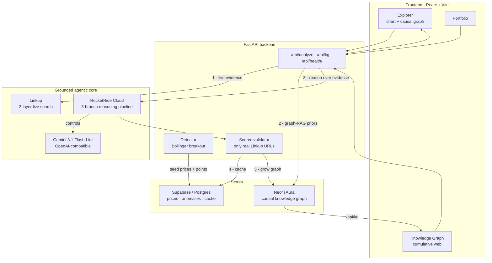
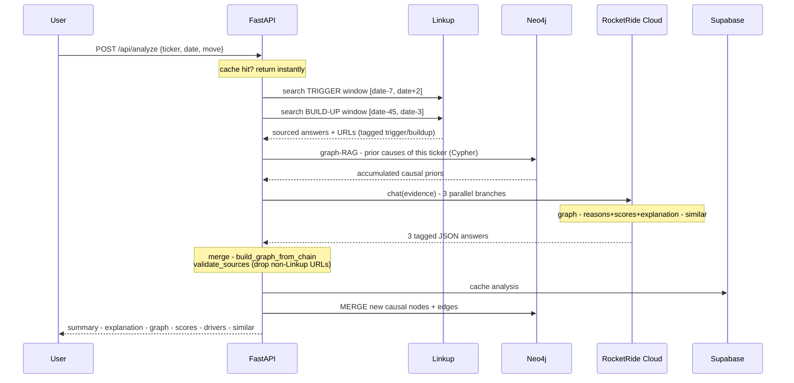
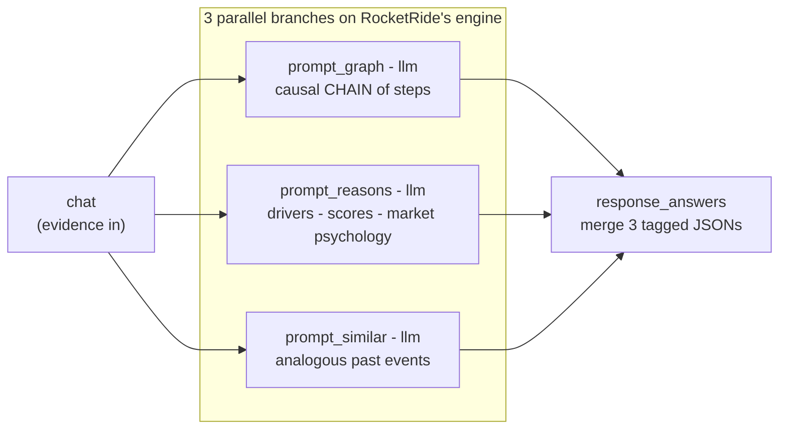
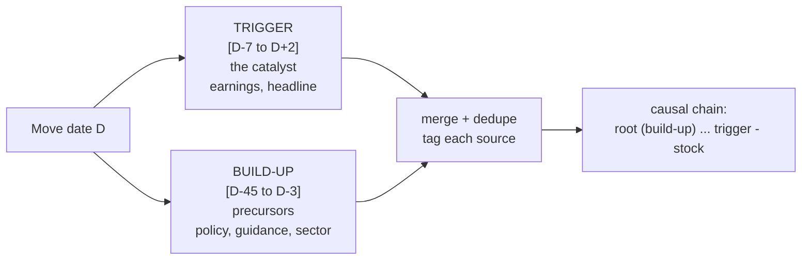
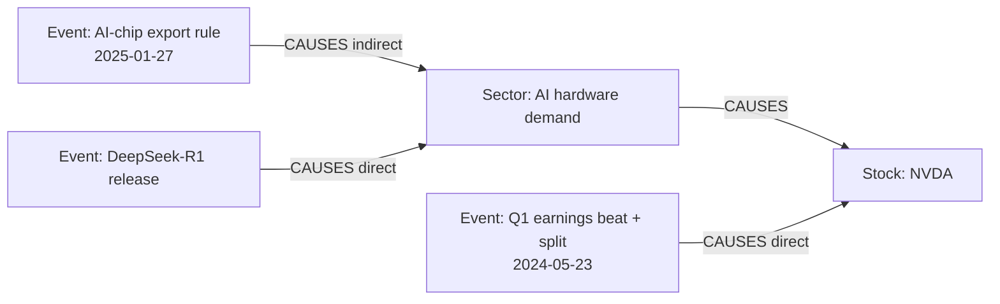

# WhyStreet — The *Why* Behind Wall Street

> A grounded, agentic explainer for stock price moves. WhyStreet detects sharp
> volatility points on a chart, then explains **why** each one happened as a
> **live-sourced causal chain** — every claim carries a real news URL, and the
> causality accumulates into a growing **Neo4j knowledge graph**.

Built for **HackWithSeattle 2.0** — *Building Grounded Agentic Applications with
RocketRide Cloud & Linkup*.

---

## 1. The problem

Markets move violently and investors are told *what* happened ("NVDA fell 17%")
but rarely *why* — and never with sources they can verify. The real cause is
usually a **chain**: a policy change → a sector shock → a competitor move → the
stock. That chain also **builds up over weeks**, not on the move's own day.

WhyStreet reconstructs that causal chain, live, with citations, and remembers it.

---

## 2. What it does

- 📈 **Detects** significant price moves with a Bollinger-breakout detector (pure math, no LLM).
- 🔎 **Grounds** each move in live news via **Linkup**, using a two-layer *market-analyst* retrieval (proximate trigger + earlier build-up).
- 🧠 **Reasons** over that evidence on a **RocketRide Cloud** pipeline (3 parallel branches) to produce: a causal-chain graph, cited drivers with confidence, risk/recovery/signal scores, a *market-psychology* explanation, and analogous past events.
- 🕸️ **Remembers** — every analysis is merged into a **Neo4j causal knowledge graph** that grows and cross-links stocks through shared events/sectors, and grounds future analyses (graph-RAG).
- ✅ **Verifies** — every reason/edge/node URL must be one Linkup actually returned; hallucinated links are dropped.

Three views: **Explorer** (chart + analysis), **Knowledge Graph** (the growing web), **Portfolio** (holdings + "why did my stock move?").

---

## 3. System architecture



---

## 4. The analysis pipeline (per click)

When you click a point (or a portfolio "Why?"), one request runs this flow:



---

## 5. How it uses RocketRide Cloud

RocketRide is the **reasoning brain**, not a single LLM call. The deployed
`.pipe` fans one evidence message into **three concurrent branches** and merges them:



- **Parallel multi-branch** — each branch has a focused job and reasons over the *same* live evidence; the backend then deterministically assembles the graph (`build_graph_from_chain`) so nodes/edges are always well-formed (no dangling edges, exactly one stock node).
- **Provider-agnostic LLM** — the LLM node is env-driven (`${ROCKETRIDE_LLM_*}`); currently **Gemini 3.1 Flash-Lite** via the OpenAI-compatible endpoint (free, fast, survives 3 concurrent calls).
- **Persistent task + auto-reconnect** — the pipeline is started once and the token reused; the backend transparently reconnects if a websocket drops.
- **Deep dive:** we studied RocketRide's `db_neo4j`, wave-planning `agent_rocketride`, `qdrant`, and `memory_persistent` nodes — the Neo4j causal-graph store is the piece we shipped.

---

## 6. Two-layer *market-analyst* retrieval (Linkup)

A move's cause is rarely confined to the move's own day. WhyStreet issues **two
date-scoped Linkup searches** and lets the pipeline separate the proximate
trigger from the earlier build-up:



Example (NVDA, 27 Jan 2025): build-up surfaces the **Jan 6 AI-chip export rule**;
trigger surfaces **DeepSeek-R1 (Jan 27)** → chain =
*export rule → revenue-growth fear → DeepSeek shock → Big-Tech capex fear → NVDA −17%*.

`fromDate`/`toDate` (publication-date filter) is the reliable time lever — it stops
Linkup from returning the same famous article for every date.

---

## 7. The causal knowledge graph (Neo4j)

Every analysis is merged into a real graph database. Nodes are deduped by label,
so a shared driver (a sector, a policy) links **multiple stocks and multiple dates**.



- **Write:** `MERGE (:KG:Event|Entity|Sector|Stock {name})-[:CAUSES {tier,direction,confidence}]->`
- **Read (graph-RAG):** a multi-hop Cypher query `(:KG)-[:CAUSES*1..3]->(:Stock {name})` retrieves what has historically driven a ticker, injected as context to ground the next analysis (toggle `GRAPHRAG_PRIORS`).
- **Serve:** the Knowledge Graph view (`/api/kg`) is rendered straight from Neo4j (Supabase mirror as fallback).

---

## 8. The detector (why the points are trustworthy)

Pure math, no LLM — reproducible and honest.

| Choice | Value | Why |
| --- | --- | --- |
| Method | **Bollinger-band breakout episodes** | Matches how trading desks think (MA line + bands); catches both 1-day spikes and slow multi-week legs |
| Bands | 20-day SMA ± **2σ** | Classic Bollinger |
| Anchor | **start** of the breakout | The catalyst day, not the exhausted top (markers don't lag the event) |
| Filter | leg ≥ **3%**, top **15**/ticker | Drop noise, keep the meaningful moves |
| Universe | 12 tickers, ~5y daily (Yahoo) | AAPL NVDA TSLA MSFT GOOGL AMZN META AMD NFLX JPM COIN BA |

Rejected alternatives: rolling z-score (too noisy), Lee-Mykland jump test (misses slow legs). See `docs/03-detector.md`.

---

## 9. Data model

```mermaid
erDiagram
    stocks ||--o{ price_bars : has
    stocks ||--o{ anomaly_points : has
    stocks ||--o{ analysis_results : has
    price_bars { date date; float close; int volume }
    anomaly_points { date date; float return_pct; float zscore }
    analysis_results { date date; text summary; text explanation; jsonb graph; jsonb scores; jsonb similar_events; text_array sources }
```

Plus **Neo4j**: `(:KG)` nodes + `[:CAUSES]` relationships (the cumulative graph).

---

## 10. Tech stack

| Layer | Tech |
| --- | --- |
| Grounding | **Linkup** (live web search, sourced answers) |
| Reasoning | **RocketRide Cloud** pipeline + **Gemini 3.1 Flash-Lite** (OpenAI-compatible) |
| Knowledge graph | **Neo4j Aura** (Cypher, graph-RAG) |
| Data / cache | **Supabase** (Postgres, direct psycopg2) |
| Backend | **FastAPI** (async, auto-reconnect) |
| Frontend | **React + Vite**, `lightweight-charts`, `react-force-graph-2d`, `lucide-react` |
| Detector | **Python** (pandas, yfinance) |

---

## 11. Repository structure

```
whystreet/
├── detector/     Python - fetch Yahoo prices, Bollinger-breakout detection, seed Supabase
├── pipeline/     RocketRide .pipe generator + prompts (build_pipe.py -> whystreet.pipe)
├── backend/      FastAPI - Linkup retrieval, RocketRide reasoning, Neo4j graph, validation
├── frontend/     React + Vite - Explorer / Knowledge Graph / Portfolio
├── supabase/     schema.sql
└── docs/         design + decision records (detector, pipeline, anti-hallucination)
```

---

## 12. Run locally

```bash
# 0) secrets - copy and fill (Linkup, RocketRide, Supabase, Gemini, Neo4j)
cp .env.example .env

# 1) data (one-time): fetch prices + detect points + seed Supabase
cd detector && python seed.py && cd ..

# 2) backend - starts the RocketRide pipeline, serves the API
python -m uvicorn backend.app:app --port 8000

# 3) frontend
cd frontend && npm install && npm run dev      # http://localhost:5173
```

Env: `ROCKETRIDE_*` (URI/APIKEY/LLM/Linkup/Neo4j), `SUPABASE_*`, `VITE_*`.
`GRAPHRAG_PRIORS=on|off` toggles graph-RAG grounding.

---

## 13. Design principles

- **Grounded, not generated** — no claim survives without a live Linkup source URL.
- **Deterministic where it matters** — detection is math; the graph is assembled in code from an LLM chain, so it's always well-formed.
- **Causality is temporal** — retrieval spans the weeks *before* a move, not just the day of.
- **Knowledge compounds** — every analysis makes the next one smarter via the graph.

---

## 14. Honest status

- Analyses run live end-to-end (Linkup → RocketRide → Neo4j) and are cached.
- Graph-RAG grounding is gated (`GRAPHRAG_PRIORS`) because a weak free model can bleed a prior event into an unrelated summary; the quarantine + reorder fix keeps it accurate.
- RocketRide Cloud can be intermittently slow/unavailable under load; the backend auto-reconnects and retries.
- Secrets live only in `.env` (git-ignored). Rotate any shared keys after the event.
